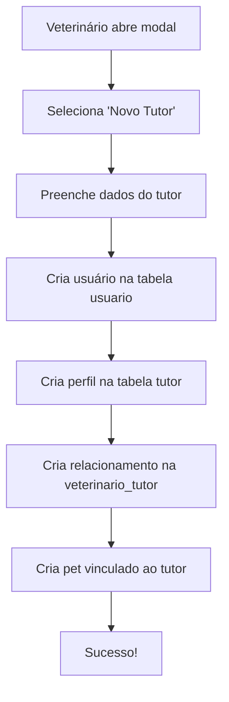
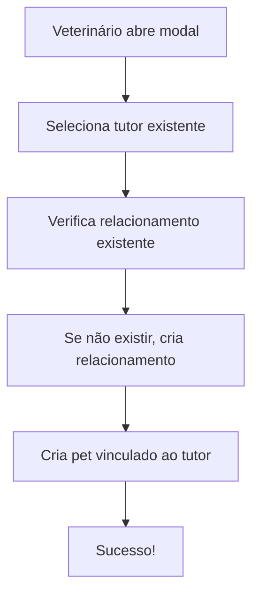

# Relacionamento Veterinário-Tutor

## 📋 Visão Geral

Este documento descreve a implementação do relacionamento direto entre veterinários e tutores na plataforma, substituindo a abordagem anterior que dependia apenas de pets e consultas para estabelecer conexões.

## 🏗️ Nova Estrutura de Banco de Dados

### Estrutura Correta das Tabelas

#### 1. Tabela: `usuario` (Autenticação)

```sql
-- Dados básicos de autenticação
CREATE TABLE usuario (
  id_usuario UUID PRIMARY KEY DEFAULT gen_random_uuid(),
  email VARCHAR UNIQUE NOT NULL,
  tipo_usuario VARCHAR(20) NOT NULL CHECK (tipo_usuario IN ('tutor', 'veterinario', 'parceiro', 'anunciante')),
  status VARCHAR(20) DEFAULT 'ativo' CHECK (status IN ('ativo', 'inativo', 'pendente')),
  created_at TIMESTAMP DEFAULT NOW()
);
```

#### 2. Tabela: `tutor` (Dados Específicos)

```sql
-- Dados específicos do tutor
CREATE TABLE tutor (
  id_tutor UUID PRIMARY KEY REFERENCES usuario(id_usuario),
  nome VARCHAR NOT NULL,
  telefone VARCHAR(15),
  cpf VARCHAR(11) UNIQUE,
  endereco TEXT,
  cidade VARCHAR(100),
  estado VARCHAR(2),
  cep VARCHAR(8),
  created_at TIMESTAMP DEFAULT NOW()
);
```

#### 3. Tabela: `veterinario_tutor` (Relacionamento)

```sql
CREATE TABLE veterinario_tutor (
  id SERIAL PRIMARY KEY,
  veterinario_id UUID REFERENCES usuario(id_usuario) NOT NULL,
  tutor_id UUID REFERENCES usuario(id_usuario) NOT NULL,
  data_inicio TIMESTAMP DEFAULT NOW(),
  status VARCHAR(20) DEFAULT 'ativo' CHECK (status IN ('ativo', 'inativo', 'pendente')),
  observacoes TEXT,
  UNIQUE(veterinario_id, tutor_id)
);

-- Índices para performance
CREATE INDEX idx_veterinario_tutor_veterinario ON veterinario_tutor(veterinario_id);
CREATE INDEX idx_veterinario_tutor_tutor ON veterinario_tutor(tutor_id);
CREATE INDEX idx_veterinario_tutor_status ON veterinario_tutor(status);
```

### Campos das Tabelas

#### **Tabela `usuario`:**

- **`id_usuario`**: Identificador único (UUID) para autenticação
- **`email`**: Email único para login
- **`tipo_usuario`**: Tipo de usuário (tutor, veterinário, etc.)
- **`status`**: Status da conta (ativo, inativo, pendente)

#### **Tabela `tutor`:**

- **`id_tutor`**: Referência ao `id_usuario` (chave estrangeira)
- **`nome`**: Nome completo do tutor
- **`telefone`**: Número de telefone
- **`cpf`**: CPF único do tutor
- **`endereco`**: Endereço completo
- **`cidade`**: Cidade
- **`estado`**: Estado (UF)
- **`cep`**: CEP

#### **Tabela `veterinario_tutor`:**

- **`id`**: Identificador único do relacionamento
- **`veterinario_id`**: Referência ao usuário veterinário
- **`tutor_id`**: Referência ao usuário tutor
- **`data_inicio`**: Data de início do relacionamento
- **`status`**: Status atual do relacionamento
- **`observacoes`**: Notas adicionais

## 🔄 Fluxo de Funcionamento

### 1. Criação de Novo Tutor por Veterinário



**Detalhamento do processo:**

1. **Criar na `usuario`**: Apenas dados de autenticação (email, tipo_usuario, status)
2. **Criar na `tutor`**: Dados específicos (nome, telefone, CPF, endereço, etc.)
3. **Criar relacionamento**: Conectar veterinário e tutor
4. **Criar pet**: Vincular ao tutor criado

### 2. Seleção de Tutor Existente



**Detalhamento do processo:**

1. **Selecionar tutor**: Da lista de tutores já relacionados
2. **Verificar relacionamento**: Se não existir, criar na `veterinario_tutor`
3. **Criar pet**: Vincular ao tutor selecionado

## 🛠️ Implementação no Código

### Arquivos Modificados

1. **`ModalNovoPaciente.jsx`**

   - **Criação em duas etapas**: Primeiro na `usuario`, depois na `tutor`
   - **Separação de responsabilidades**: Autenticação vs. dados específicos
   - **Implementa criação automática** de relacionamento
   - **Usa novos utilitários** para gerenciar relacionamentos

2. **`veterinarioTutor.js`** (Novo)
   - Utilitários para CRUD de relacionamentos
   - Funções para buscar tutores relacionados
   - Estatísticas de relacionamentos

### Estrutura de Criação de Tutor

```javascript
// 1. Criar usuário (autenticação)
const { data: novoUsuario } = await supabase
  .from("usuario")
  .insert([
    {
      id_usuario: crypto.randomUUID(),
      email: formData.tutorEmail,
      tipo_usuario: "tutor",
      status: "ativo",
    },
  ])
  .select()
  .single();

// 2. Criar perfil do tutor (dados específicos)
const { data: novoTutor } = await supabase
  .from("tutor")
  .insert([
    {
      id_tutor: novoUsuario.id_usuario, // Mesmo ID
      nome: formData.tutorNome,
      telefone: limparMascara(formData.tutorTelefone),
      cpf: limparMascara(formData.tutorCpf),
      endereco: formData.tutorEndereco,
      cidade: formData.tutorCidade,
      estado: formData.tutorEstado,
      cep: limparMascara(formData.tutorCep),
    },
  ])
  .select()
  .single();

// 3. Criar relacionamento
await criarRelacionamentoVeterinarioTutor(
  session.user.id,
  novoUsuario.id_usuario,
  "Relacionamento criado automaticamente"
);
```

### Principais Funções

#### `criarRelacionamentoVeterinarioTutor(veterinarioId, tutorId, observacoes)`

Cria um novo relacionamento entre veterinário e tutor.

#### `buscarTutoresRelacionados(veterinarioId, status)`

Busca todos os tutores relacionados a um veterinário específico.

#### `verificarRelacionamentoExistente(veterinarioId, tutorId)`

Verifica se já existe relacionamento entre veterinário e tutor.

## 🔐 Políticas de Segurança (RLS)

### Política de Inserção

```sql
CREATE POLICY "Veterinários podem criar relacionamentos" ON veterinario_tutor
FOR INSERT WITH CHECK (
  EXISTS (
    SELECT 1 FROM usuario
    WHERE id_usuario = auth.uid()
    AND tipo_usuario = 'veterinario'
  )
);
```

### Política de Leitura

```sql
CREATE POLICY "Usuários podem ver seus relacionamentos" ON veterinario_tutor
FOR SELECT USING (
  veterinario_id = auth.uid() OR tutor_id = auth.uid()
);
```

### Política de Atualização

```sql
CREATE POLICY "Veterinários podem atualizar seus relacionamentos" ON veterinario_tutor
FOR UPDATE USING (
  veterinario_id = auth.uid()
);
```

## 📊 Benefícios da Nova Estrutura

### ✅ Vantagens

1. **Relacionamento Explícito**: Conexão direta entre veterinário e tutor
2. **Histórico Rastreável**: Data de início e observações do relacionamento
3. **Status Flexível**: Pode ser ativo, inativo ou pendente
4. **Consultas Eficientes**: Busca rápida de tutores por veterinário
5. **Base para Funcionalidades Futuras**: Chat, notificações, relatórios

### 🔄 Migração de Dados

Para migrar dados existentes, execute:

```sql
-- Criar relacionamentos baseados em pets existentes
INSERT INTO veterinario_tutor (veterinario_id, tutor_id, status, observacoes)
SELECT DISTINCT
  p.veterinario_id,
  p.usuario_id,
  'ativo',
  'Migrado automaticamente de pets existentes'
FROM pets p
WHERE p.veterinario_id IS NOT NULL
  AND p.usuario_id IS NOT NULL
ON CONFLICT (veterinario_id, tutor_id) DO NOTHING;
```

## 🚀 Funcionalidades Futuras

### 1. Sistema de Mensagens

- Chat direto entre veterinário e tutor
- Notificações de consultas e resultados

### 2. Relatórios de Relacionamento

- Estatísticas de tutores por veterinário
- Histórico de consultas por relacionamento

### 3. Sistema de Recomendações

- Sugestões de tutores para veterinários
- Recomendações de veterinários para tutores

### 4. Gestão de Status

- Interface para ativar/desativar relacionamentos
- Comentários e observações sobre relacionamentos

## 🧪 Testes

### Cenários de Teste

1. **Criação de Novo Tutor**

   - Veterinário cria tutor com dados válidos
   - Verificar se usuário é criado na tabela `usuario`
   - Verificar se relacionamento é criado na `veterinario_tutor`

2. **Seleção de Tutor Existente**

   - Veterinário seleciona tutor da lista
   - Verificar se relacionamento é criado se não existir
   - Verificar se pet é criado corretamente

3. **Validações**

   - Tentar criar tutor com dados inválidos
   - Verificar mensagens de erro apropriadas
   - Testar máscaras de CPF, telefone e CEP

4. **Relacionamentos Duplicados**
   - Tentar criar relacionamento já existente
   - Verificar se não há duplicação

## 📝 Notas de Implementação

- **UUID**: Usado para gerar IDs únicos para novos usuários
- **Tratamento de Erros**: Relacionamentos falham graciosamente (não impedem criação de pets)
- **Logs**: Todos os erros são logados para debugging
- **Performance**: Índices criados para consultas frequentes
- **Segurança**: Políticas RLS implementadas para controle de acesso

## 🔧 Comandos SQL para Banco de Dados

```sql
-- 1. Criar tabela usuario (se não existir)
CREATE TABLE IF NOT EXISTS usuario (
  id_usuario UUID PRIMARY KEY DEFAULT gen_random_uuid(),
  email VARCHAR UNIQUE NOT NULL,
  tipo_usuario VARCHAR(20) NOT NULL CHECK (tipo_usuario IN ('tutor', 'veterinario', 'parceiro', 'anunciante')),
  status VARCHAR(20) DEFAULT 'ativo' CHECK (status IN ('ativo', 'inativo', 'pendente')),
  created_at TIMESTAMP DEFAULT NOW()
);

-- 2. Criar tabela tutor (se não existir)
CREATE TABLE IF NOT EXISTS tutor (
  id_tutor UUID PRIMARY KEY REFERENCES usuario(id_usuario),
  nome VARCHAR NOT NULL,
  telefone VARCHAR(15),
  cpf VARCHAR(11) UNIQUE,
  endereco TEXT,
  cidade VARCHAR(100),
  estado VARCHAR(2),
  cep VARCHAR(8),
  created_at TIMESTAMP DEFAULT NOW()
);

-- 3. Criar tabela veterinario_tutor
CREATE TABLE IF NOT EXISTS veterinario_tutor (
  id SERIAL PRIMARY KEY,
  veterinario_id UUID REFERENCES usuario(id_usuario) NOT NULL,
  tutor_id UUID REFERENCES usuario(id_usuario) NOT NULL,
  data_inicio TIMESTAMP DEFAULT NOW(),
  status VARCHAR(20) DEFAULT 'ativo' CHECK (status IN ('ativo', 'inativo', 'pendente')),
  observacoes TEXT,
  UNIQUE(veterinario_id, tutor_id)
);

-- 4. Criar índices para performance
CREATE INDEX IF NOT EXISTS idx_veterinario_tutor_veterinario ON veterinario_tutor(veterinario_id);
CREATE INDEX IF NOT EXISTS idx_veterinario_tutor_tutor ON veterinario_tutor(tutor_id);
CREATE INDEX IF NOT EXISTS idx_veterinario_tutor_status ON veterinario_tutor(status);

-- 5. Criar políticas RLS para veterinario_tutor
ALTER TABLE veterinario_tutor ENABLE ROW LEVEL SECURITY;

-- Política de inserção
CREATE POLICY "Veterinários podem criar relacionamentos" ON veterinario_tutor
FOR INSERT WITH CHECK (
  EXISTS (
    SELECT 1 FROM usuario
    WHERE id_usuario = auth.uid()
    AND tipo_usuario = 'veterinario'
  )
);

-- Política de leitura
CREATE POLICY "Usuários podem ver seus relacionamentos" ON veterinario_tutor
FOR SELECT USING (
  veterinario_id = auth.uid() OR tutor_id = auth.uid()
);

-- Política de atualização
CREATE POLICY "Veterinários podem atualizar seus relacionamentos" ON veterinario_tutor
FOR UPDATE USING (
  veterinario_id = auth.uid()
);

-- 6. Políticas RLS para tabela tutor
ALTER TABLE tutor ENABLE ROW LEVEL SECURITY;

-- Política de inserção para tutor
CREATE POLICY "Veterinários podem criar perfis de tutor" ON tutor
FOR INSERT WITH CHECK (
  EXISTS (
    SELECT 1 FROM usuario
    WHERE id_usuario = auth.uid()
    AND tipo_usuario = 'veterinario'
  )
);

-- Política de leitura para tutor
CREATE POLICY "Usuários podem ver seus próprios perfis" ON tutor
FOR SELECT USING (
  id_tutor = auth.uid()
);

-- Política de atualização para tutor
CREATE POLICY "Usuários podem atualizar seus próprios perfis" ON tutor
FOR UPDATE USING (
  id_tutor = auth.uid()
);
```
